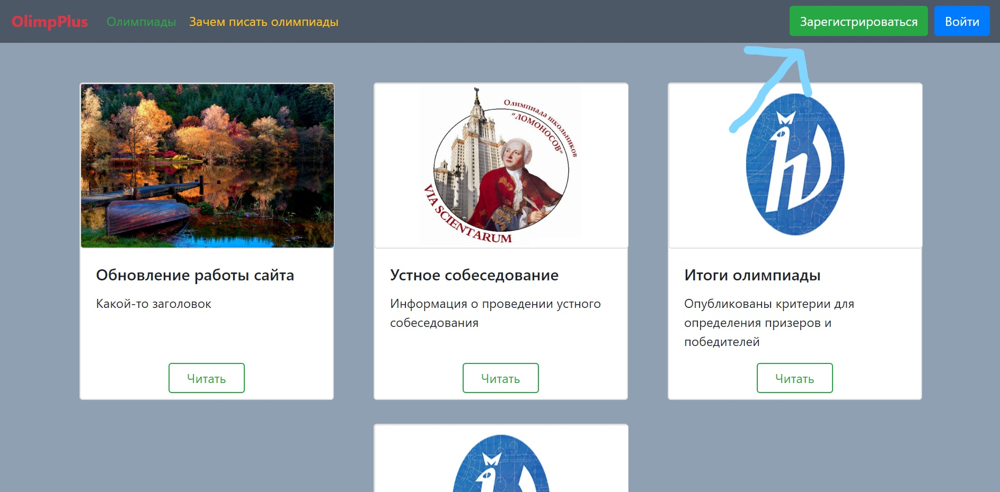

<h1 align="center">OlimpPlus</h1>

* Этот проект создан для школьников, активно принимающих участие в вузовских олимпиадах. 
На сайте содержатся последние новости, олимпиады и их график. 
* Пользователь может создать свой аккаунт и добавлять олимпиады в избранное, чтобы не забывать о них.
После этого, программа будет напонимать пользователю о предстоящих событиях по почте.
* Также, зайдя на страничку олимпиады, можно найти задания прошлых лет и подготовиться к олимпиаде.
* Администратор может добавлять олимпиады и новости через специальную форму. 
---
* Пока, я не тратил время на заполнение статической информации (текст новостей, описания олимпиад, файлы заданий), 
но сделал сервис, готовый к загрузке этих данных. 
* Все даты олимпиад и прочая информация тестовая, то есть не соответствует действительности. 
---


## Как им пользоваться?
1. Перейти в папку application/static/tasks и распаковать zip папку tasks в сюда же (в application/static/tasks).
2. Для отправки почты нужно в файле mailing.py (функция send_messages) указать свой логин и пароль от почты для того, 
чтобы программа могла отправлять уведомления-напоминания на почты участников.

3. Должно получиться что-то вроде этого: 
```python
def send_messages(users, message):
    ..............

    # Здесь надо указать логин и пароль от почты, с которой будут отправляться сообщения
    smtp_server = 'smtp.gmail.com'
    login = email_address@gmail.com  # Ваш email
    password = password123  # Ваш пароль от этого email

    ..............
```

4. После этого просто запускаем файл main.py. 
5. Переходим на [Localhost](http://127.0.0.1:8080/)
6. Для начала надо зарегистрироваться, нажав на кнопку в правом верхнем углу. 

7. Теперь, вы - пользователь с id = 1 или админ. Вы можете:
    * удалять олимпиады по ссылке /del_olimps/{olimp_id} (вы не сможете их восстановить, поэтому будьте осторожны)
    *  удалять новости по ссылке /del_news/{news_id} (вы не сможете их восстановить, поэтому будьте осторожны)
    *  добавлять олимпиады по ссылке /add_olimp_group
    *  добавлять новости по ссылке /add_news
    * сделать пользователя админом по ссылке /add_admin/{user_id}
7. 

Также можно создать и обычных пользователей. Теперь эти пользователи могут читать новости и смотреть страницы олимпиады.
Чтобы принять участие в олимпиаде, надо перейти на главную страницу олимпиады и внизу страницы нажать на кнопку "Хочу участвовать".
Затем надо выбрать город, предмет и класс и нажать на кнопку "Участвовать". 
Чтобы перейти в личный кабинет, надо нажать на иконку профиля (верхний правый угол) и выбрать "Мои олимпиады". 

Ещё можно потренироваться перед олимпиадой и порешать задания. Для этого надо перейти на 
страницу олимпиады и там перейти по ссылке "Задания прошлых лет". Затем надо выбрать предмет и 
класс и нажать на кнопку "Скачать задания". Пока все файлы с заданиями пустые, но их надо будет просто заполнить.
