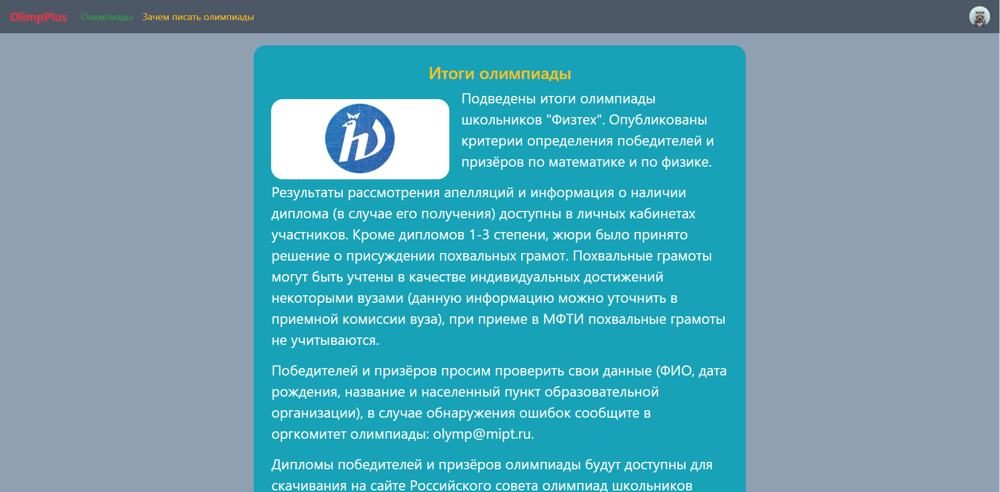

<h1 align="center">OlimpPlus</h1>

* Этот проект создан для школьников, активно принимающих участие в вузовских олимпиадах. 
На сайте содержатся последние новости, олимпиады и их график. 
* Пользователь может создать свой аккаунт и добавлять олимпиады в избранное, чтобы не забывать о них.
После этого, программа будет напонимать пользователю о предстоящих событиях по почте.
* Также, зайдя на страничку олимпиады, можно найти задания прошлых лет и подготовиться к олимпиаде.
* Администратор может добавлять олимпиады и новости через специальную форму. 
---
* Пока, я не тратил время на заполнение статической информации (текст новостей, описания олимпиад, файлы заданий), 
но сделал сервис, готовый к загрузке этих данных. 
* Все даты олимпиад и прочая информация тестовая, то есть не соответствует действительности. 
---





## Как им пользоваться?
1. Перейти в папку application/static/tasks и распаковать zip папку tasks в сюда же (в application/static/tasks).
2. Для отправки почты нужно в файле mailing.py (функция send_messages) указать свой логин и пароль от почты для того, 
чтобы программа могла отправлять уведомления-напоминания на почты участников.

3. Должно получиться что-то вроде этого: 
```python
def send_messages(users, message):
    ..............

    # Здесь надо указать логин и пароль от почты, с которой будут отправляться сообщения
    smtp_server = 'smtp.gmail.com'
    login = email_address@gmail.com  # Ваш email
    password = password123  # Ваш пароль от этого email

    ..............
```

4. После этого просто запускаем файл main.py.

5. Переходим на [Localhost](http://127.0.0.1:8080/)

6. Для начала надо зарегистрироваться, нажав на кнопку в правом верхнем углу. 

7. Теперь, вы - пользователь с id = 1 или админ. Вы можете:
    * удалять олимпиады по ссылке /del_olimps/{olimp_id} (вы не сможете их восстановить, поэтому будьте осторожны)
    *  удалять новости по ссылке /del_news/{news_id} (вы не сможете их восстановить, поэтому будьте осторожны)
    *  добавлять олимпиады по ссылке /add_olimp_group
    *  добавлять новости по ссылке /add_news
    * сделать пользователя админом по ссылке /add_admin/{user_id}
    
    * смотреть различные олимпиады, нажав на кнопку "Олимпиады"
    * просмотреть информацию о конкретной олимпиаде
    * зайти в личный кабинет, нажав на иконку профиля в верхнем правом углу и посмотреть список своих олимпиад
    * принять участие в олимпиаде, нажав на кнопку "Хочу участвовать" внизу страницы олимпиады
    * порешать задания прошлых лет, нажав на кнопку "Задания прошлых лет" в начале страницы олимпиады
    * почитать зачем нужны олимпиады, нажав на кнопку "Зачем писать олимпиады"
    
    * смотреть новости, нажав на логотип "OlimpPlus"
    * прочитать конкретную новость на странице новостей
    
    * можете редактировать свой профиль 


8. После этого, можно создавать и обычных пользователей (не администраторов), и у них будут те же возможности, за исключением добавления и удаления новостей и олимпиад.

# Цели на будущее

* добавить возможность авторизации при помощи популярных соц.сетей (Vk, Instagram, Facebook и т.д.)
* улучшить интерфейс создания новостей и олимпиад, а также возможность редактирования дат олимпиад НЕ через БД напрямую
* в будущем я хочу создать некую социальную сеть для людей, увлекающимися олимпиадами. Таким образом, пользователи получат возможность более тонкой персонализации профиля, на сервисе появится внутренний рейтинг, возможность добавлять друзей и многое другое! 
